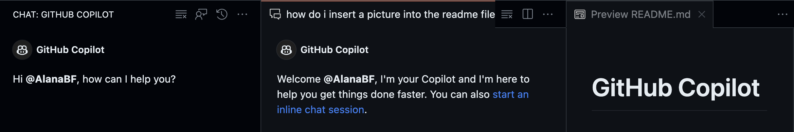

# Exploring GitHub Copilot: A Junior Developer's Journey

>***By Alana Barrett-Frew, Version 1 Associate Consultant***

- [Exploring GitHub Copilot: A Junior Developer's Journey](#exploring-github-copilot-a-junior-developers-journey)
  - [Introduction](#introduction)
  - [What can GitHub Copilot do?](#what-can-github-copilot-do)
  - [Insights and Learnings](#insights-and-learnings)
    - [1. Code Suggestions](#1-code-suggestions)
    - [2. Autocomplete](#2-autocomplete)
    - [3. Documentation](#3-documentation)
    - [4. Learning New Languages](#4-learning-new-languages)
    - [5. Code Refactoring](#5-code-refactoring)
    - [6. Test Writing](#6-test-writing)
  - [Future Endeavors](#future-endeavors)
  - [Reflection and Conclusion](#reflection-and-conclusion)
  - [Appendix](#appendix)
    - [Appendix 1: A few helpful shortcuts](#appendix-1-a-few-helpful-shortcuts)
    - [Appendix 2: Create a New Workspace](#appendix-2-create-a-new-workspace)
    - [Appendix 3: Create a New Notebook](#appendix-3-create-a-new-notebook)

## Introduction

As an Associate Consultant with Version 1 diving into my first project - an AI project, I found myself fortunate to explore GitHub Copilot, an intriguing tool revolutionising how developers approach coding challenges. In this blog, I'll share my experience and insights gained from leveraging GitHub Copilot both as a developer exploring the offering, and as a newcomer to a complex AI project.

## What can GitHub Copilot do?

Once you have a GitHub Copilot subscription, download these 2 extensions in VSCode to get started:

- GitHub Copilot
- GitHub Copilot Chat

Once you have these extensions you can open the GitHub Copilot chat and then start exploring:

1. [Code Suggestions](#1-code-suggestions): GitHub Copilot provides suggestions for whole lines or blocks of code as you type. This can help developers learn new coding patterns and libraries quickly.

2. [Autocomplete](#2-autocomplete) GitHub Copilot autocompletes function calls, method names, variable names, and more. This can help developers learn the correct usage of these elements.

3. [Documentation](#3-documentation) GitHub Copilot can generate comments that explain what a piece of code does. This can help developers understand complex code quickly.

4. [Learning New Languages](#4-learning-new-languages) GitHub Copilot supports many programming languages. Developers can use it to learn the syntax and idioms of a new language quickly.

5. [Code Refactoring](#5-code-refactoring) GitHub Copilot can suggest alternative ways to write the same code, helping developers learn better coding practices.

6. [Test Writing](#6-test-writing) GitHub Copilot can generate test cases for your functions, helping developers learn how to write effective tests.

## Insights and Learnings

Through this exploration, several key learnings and future steps emerged:

### 1. Code Suggestions

- This feature predicts and suggests the next lines or blocks of code based on the context of what you've already written.
- It can suggest entire functions, loops, or other complex pieces of code.
- It's designed to assist with coding tasks and help you discover new coding practices.

***Example***

Writing the following comment in my code

`// function to render a counter`

GitHub Copilot provided a relevant code suggestion in the file itself. Pressing ```tab``` rendered the code for me to then edit and adapt as necessary.


### 2. Autocomplete

- This feature completes the word or line you're currently typing.
- It's most useful for completing variable names, function names, or other pieces of code that you've already started typing.
- It helps to speed up coding and reduce typos.

***Example***

You can demonstrate autocomplete by starting to type a piece of code. The IDE will automatically suggest completions for your code as you type. If you like what you see press ```tab```  and it will complete the line.


### 3. Documentation

GitHub Copilot assists with documentation in several ways:

- **Code Explanation**: It can provide explanations for complex pieces of code, which is useful when trying to understand a new codebase or a complex algorithm.
- **Comment Generation**: It can generate comments for your code, helping to document your codebase and make it easier for others to understand.
- **Documentation Lookup**: It can help you look up documentation for different functions, classes, or libraries that you're using, saving you time and helping you understand how to use these resources more effectively.

My explorations began with a thorough examination of the project's codebase before engaging with GitHub Copilot. Taking the main router page as an example, I aimed to decipher its functionality and structure, seeking clarity and understanding. Asking Copilot to explain the code provided me with detailed insights into the React application's setup and routing mechanisms.

With Copilot's assistance, I proceeded to annotate the code for beginners, transforming complex lines into comprehensible explanations. This step significantly aided my comprehension and familiarisation with the codebase, accelerating my onboarding process within the project.

***Example***

```javascript

function App() {
  return (
    <>
      <HashRouter>
        <Routes>
          <Route element={<AppContextLayout />}>
            <Route path="/" element={<Login />} />
            <Route path="/chatwindow" element={<Chat />} />
            {/* Add your 404 fallback route */}
            <Route path="*" element={<NoPage />} />
          </Route>
        </Routes>
      </HashRouter>
    </>
  );
}

export default App;
```

GitHub Copilot "Can you explain this code to me?".
It gave a very detailed response.

>
> This code defines the main component of a React application. It sets up the routing for different pages of the application using the react-router-dom library. The BrowserRouter component is used to wrap the Routes component, which defines the different routes of the application. The Route component is used to define each individual route, with the element prop specifying the component to render when the route is accessed.
>
> In this specific code, the App component renders a HashRouter component, which is a type of BrowserRouter that uses the URL hash to keep track of the current route. Inside the HashRouter, there is a Routes component that defines the different routes of the application. The Route component is used to define each individual route, with the element prop specifying the component to render when the route is accessed.
>
> The AppContextLayout component is rendered for all routes, and the Login component is rendered when the route is /. The Chat component is rendered when the route is /chatwindow. Finally, the NoPage component is rendered when the route does not match any of the defined routes.

GitHub Copilot "Add comments to the code for a beginner"

```javascript
// Main function component of the application
function App() {
  return (
    <>
      {/* HashRouter is a router implementation that uses the hash portion of the URL (i.e. window.location.hash) to keep your UI in sync with the URL */}
      <HashRouter>
        {/* Routes is a component that allows you to define multiple routes for your application */}
        <Routes>
          {/* Route is a component that allows you to define a route for a specific path */}
          <Route element={<AppContextLayout />}>
            {/* Route for the root ("/") path. When the user navigates to this path, the Login component will be rendered */}
            <Route path="/" element={<Login />} />
            {/* Route for the "/chatwindow" path. When the user navigates to this path, the Chat component will be rendered */}
            <Route path="/chatwindow" element={<Chat />} />
            {/* Fallback route. When the user navigates to a path that is not defined, the NoPage component will be rendered */}
            <Route path="*" element={<NoPage />} />
          </Route>
        </Routes>
      </HashRouter>
    </>
  );
}

// Exporting the App component to be used in other parts of the application
export default App;
```

### 4. Learning New Languages

GitHub Copilot can be a valuable tool when learning new programming languages:

- **Syntax Assistance**: It can suggest the correct syntax for the language you're using, which is especially helpful when you're just starting to learn a new language and are not yet familiar with its syntax.
- **Code Examples**: It can provide examples of how to use different functions, classes, or libraries in the language you're learning. These examples can help you understand how to use these resources effectively.
- **Error Correction**: It can suggest corrections for common errors, helping you learn from your mistakes and understand how to avoid them in the future.
- **Notebook Creation**: It can assist in creating a notebook of notes, providing code snippets, explanations, and examples that you can add to your notebook.
- **Topic-Specific Help**: It can provide suggestions or resources for further learning on a specific topic.

Considering Copilot's utility in dissecting and documenting backend Python code, I created a Jupyter Notebook to start learning Python and moving forwards in the future I will use it to help me understand the backend functionality and its interactions with the frontend.

***Example***


This command produced a Jupyter Notebook split into subsections with example code. This concept could be developed further for supporting developers new to the code with minimal effort. See [Appendix 3](#appendix-3-create-a-new-notebook) for complete instructions and GitHub Copilot created example.

### 5. Code Refactoring

- GitHub Copilot can suggest ways to refactor code based on patterns it has learned from a vast corpus of public code.
- It can provide suggestions for simplifying code, improving readability, and enhancing performance.
- However, it's important to note that these suggestions are based on patterns and may not always be the most optimal or suitable for every specific context.

***Example***

I gave the chat feature this extract from a component

```javascript
 <div
      className={`${styles.container} ${className ?? ""} ${
        disabled && styles.disabled
      }`}
      onClick={onClick}
    >
      {/* // The text "Clear conversation" is displayed */}
      Clear conversation
      {/* // The Delete24Regular component renders a delete icon */}
      <Delete24Regular />
    </div>
```

Instruction: How would you refactor this code to improve it?

GitHub Copilot: The code you've provided is already quite clean and follows good practices for a React component. However, there are a few minor improvements that could be made:

>Use Button Element: Instead of using a div for the button, you could use a button element. This is more semantically correct and can improve accessibility.

```javascript
// Define the ClearChatButton component
export const ClearChatButton = ({ className, disabled, onClick }: Props) => {
  return (
    <button
      className={`${styles.container} ${className ?? ""} ${
        disabled ? styles.disabled : ""
      }`}
      onClick={onClick}
      disabled={disabled}
    >
      Clear conversation
      <Delete24Regular />
    </button>
  );
};
```

### 6. Test Writing

- GitHub Copilot can assist in writing tests by providing suggestions for test cases based on the function or component you're testing.
- It can suggest appropriate testing frameworks and methods, set up test structures, and even provide examples of assertions.
- In addition to basic rendering tests, you can also write more complex tests:

>- **Event Testing**: Simulate user events like clicks or input changes and check if the component behaves as expected. For example, you can use the `fireEvent` function from React Testing Library to simulate a click event and then check if the expected action was taken.
>- **Prop Testing**: Render your component with different props and check if it behaves correctly in each case. For example, if you have a component that behaves differently based on a `isLoading` prop, you can render it with `isLoading={true}` and `isLoading={false}` and check the behavior in each case.
>- **State Testing**: If your component has internal state, you can check if the state changes correctly in response to events. For example, if you have a counter component that increments a count state when a button is clicked, you can simulate a click event and then check if the count state was incremented.
>- **Snapshot Testing**: Take a snapshot of your component and compare it to a reference snapshot to detect any unexpected changes. This can be done using the `toMatchSnapshot` function from Jest.

In addition to unit tests, there are several other types of tests you can write:

>- **Integration Testing**: This involves testing multiple parts of your application together to ensure they work correctly as a group. For example, you might test that a form submits data correctly and that the data is correctly displayed in another component.
>- **End-to-End Testing**: This involves testing your entire application from start to finish to ensure the flow works as expected. For example, you might test the entire process of a user logging in, navigating to a specific page, filling out a form, and receiving the expected result.
>- **Performance Testing**: This involves testing your application under a particular workload and measuring its response time or latency. For example, you might test how your application behaves when a large number of users are using it at the same time.
>- **Accessibility Testing**: This involves testing your application for accessibility to ensure it can be used by people with disabilities. For example, you might test that all images have alt text and that all forms can be navigated using only the keyboard.

- However, it's important to note that while GitHub Copilot can generate test cases, the quality and comprehensiveness of the tests still largely depend on the developer's input and review.

***Basic Example***

```javascript
// Define the AnswerLoading component
export const AnswerLoading = () => {
    // Define an animation for the component
    // The animation will change the opacity from 0 to 1
    const animatedStyles = useSpring({
        from: { opacity: 0 },
        to: { opacity: 1 }
    });

    // Render the AnswerLoading component
    return (
        // The animated.div component applies the animation to its children
        <animated.div style={{ ...animatedStyles }}>
            {/*  The Stack component aligns its children vertically */}
            <Stack className={styles.answerContainer} verticalAlign="space-between">
                {/* // The AnswerIcon component renders an icon */}
                <AnswerIcon />
                {/* // The Stack.Item component is a child of Stack */}
                {/* // The grow prop means that this item will take up the remaining space */}
                <Stack.Item grow>
                    {/* // The text "Generating answer" is displayed */}
                    {/* // The span with the loadingdots style is likely used for a loading animation */}
                    <p className={styles.answerText}>
                        Generating answer
                        <span className={styles.loadingdots} />
                    </p>
                </Stack.Item>
            </Stack>
        </animated.div>
    );
};
```

Intruction: Write a test for this code

GitHub Copilot: To write a test for this component, you can use a combination of Jest and React Testing Library. Here's a basic test that checks if the component renders without crashing:

```javascript
// Import necessary modules
import { render } from '@testing-library/react';
import AnswerLoading from './AnswerLoading'; // Update with the correct path to your component

describe('AnswerLoading', () => {
  it('renders without crashing', () => {
    const { getByText } = render(<AnswerLoading />);
    expect(getByText('Generating answer')).toBeInTheDocument();
  });
});
```

This test renders the `AnswerLoading` component and then checks if the text "Generating answer" is present in the document. If the component renders correctly, this test will pass.

## Future Endeavors

- Leveraging Copilot for streamlined code review processes via pull requests and issue resolution.
  
  ***Example***

  >Install from the extensions tab ```GitHub Pull Requests and Issues```
  >If there is a comment for improvement before the code is accepted, you can take the comments and use GitHub Copilot to suggest the correction.

- Venturing into creating a complete project from scratch by utilising Copilot's suggested structures and components, modifying them to suit project requirements. Speficically I will try this feature:
  >You can demonstrate code suggestions by placing the cursor at a new line and pressing Ctrl + Space. This will force VS Code to show you relevant code suggestions.

## Reflection and Conclusion

My experience with GitHub Copilot has been enlightening. As a newcomer to the project, it significantly eased the learning curve, empowering me to comprehend the codebase efficiently and contribute meaningfully. It's important to acknowledge Copilot's limitations—it's not infallible and might occasionally err. Nevertheless, it's a powerful ally that complements developers, enhancing productivity, and reducing time spent on routine searches for solutions. There is so much more to learn from it and I look forward to exploring this over the coming months and I hope you will too.

In conclusion, GitHub Copilot isn't a substitute for developers but an invaluable assistant, amplifying efficiency and augmenting the developer's toolkit.

## Appendix

### Appendix 1: A few helpful shortcuts

To clear your previous chat

```/clear```

To see all possible help commands type in the chat and choose your command then detail what you want it to do

```/``` [followed by a command]

Example

```/explain``` how the selected code works

If you open a file and highlight a selection of code then press

```ctrl shift I``` for windows

```cmd shift I``` for mac

It will bring up an inline chat window.

Then you can ask a question like what does this code do?

Or...

Add [some instruction]. It will give you an option which you can edit and if you are happy with it you can accept it and it will integrate the change into your code

If you want to view a previous search history, click the 

It will look like this:


If you don't want the chat as a sidebar, you can also select it to open as a window in the editor.




### Appendix 2: Create a New Workspace

- Enter into the chat:

 ```/new create a react app with typescript```

- It will generate a proposed directory structure. If you are happy with it, click create workspace and it will produce it for you.


- Select your folder location
- It will then create a react app in that location with the following example setup


### Appendix 3: Create a New Notebook


An example of what this command produced:


This produced a Jupyter Notebook split into subsections with example code. This concept could be developed further for supporting developers new to the code with minimal effort.

[Python For Beginners](PythonForBeginners.ipynb)